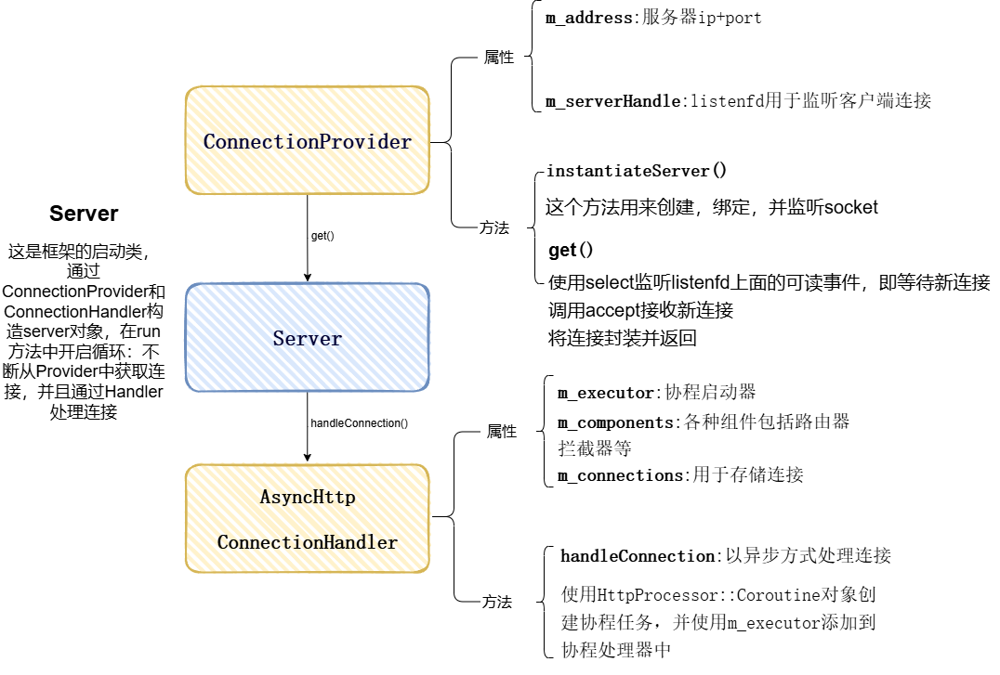
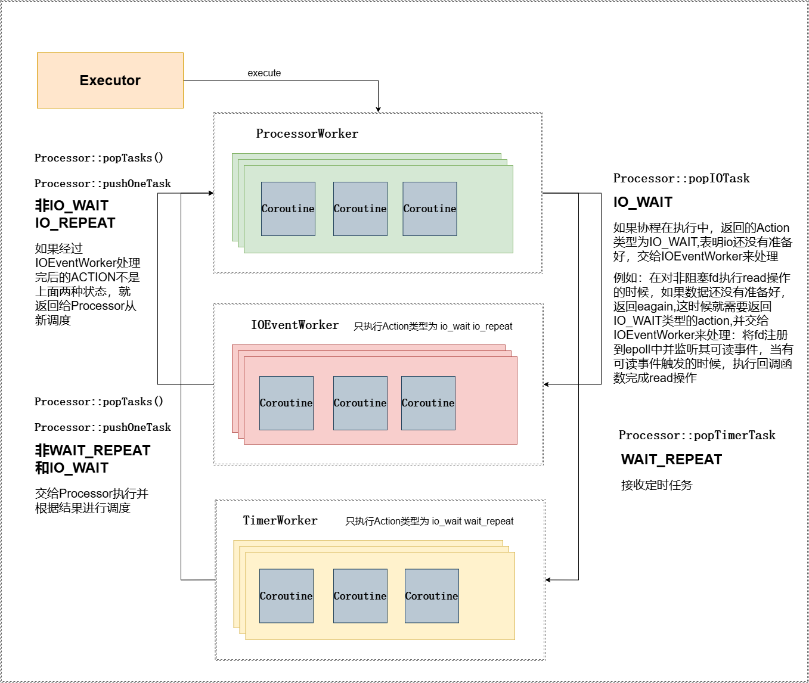

# 利用协程实现的高性能C++Web框架

本文是对项目的一个简要介绍：

**1.Web框架的整体工作流程**

**2.协程调度器**

**3.关键组件**

**4.异步连接处理器**

**5.ApiController**

**6.跨域处理**

**7.样例代码**

**8.测试**

## 1.整体流程



Server是整个项目的启动类；通过Server::run()方法启动循环，不断的获取连接并处理连接

**run**方法核心代码如下

```c++
void Server::mainLoop(Server *instance) {
  while (instance->getStatus() == STATUS_RUNNING) {
      //获取连接
    auto connectionHandle = instance->m_connectionProvider->get();
      //处理连接
    instance->m_connectionHandler->handleConnection(connectionHandle, params);
  }
}
```

构造Server需要两个组件，其一是ConnectionProvider，通过创建listenfd并使用select系统调用监听连接，并提供get函数用于接收连接;

ConnectionProvider核心代码

```c++
//创建listenfd
v_io_handle ConnectionProvider::instantiateServer(){
   serverHandle = socket(currResult->ai_family, currResult->ai_socktype, currResult->ai_protocol);
   if (bind(serverHandle, currResult->ai_addr, (int) currResult->ai_addrlen) != SOCKET_ERROR){
       listen(serverHandle, SOMAXCONN) != SOCKET_ERROR);
   }          
  return serverHandle;
}
//获取连接
provider::ResourceHandle<stream::IOStream> ConnectionProvider::get() {
  while(!m_closed){
    /*
    设置位数组
    */
    auto res = select(m_serverHandle + 1,&set,nullptr,nullptr,&timeout);
      
    if (res >= 0) {
      break;
    }
  }
  /*
  封装fd并返回
  */
}
```

AsyncHrrpConnectionHandler:封装了executor,HttpRoutor，拦截器等处理连接必备的组件，并且提供了handleConnection()方法用于异步的处理连接;后续会单独说明

## 2.协程调度器



**整个协程处理器主要由三种工作线程组成**：ProcessorWorker,IoEventWorker,TimerWorker,每种worker都具有**执行当前协程，并根据返回的动作进行调度的能力**；ProcessorWorker具有调度有所有动作的能力，IoEventWorker只有调度io_wait和io_repeat状态的能力，其他动作交给ProcessorWorker进行调度;TimerWorker只具有调度io_wait和wait_repeat状态的能力，其余动作都是交给ProcessorWorker进行调度。

**TimerWorker**：（任务来源只有ProcessorWorker）负责执行定时器任务的队列中的协程，并根据返回动作进行调度:WAIT_REPEAT，IO_WAIT留在定时器中，其余的从定时器队列中移除，将任务交给Processor;

**IOEventWorker**:（任务来源只有ProcessorWorker）将ProcessorWorker提交的任务：把fd注册到epoll中，并监听其可读或者可写事件，调用epoll_wait()执行协程，并且根据返回动作进行调度，除io_wait,io_repeat以外的任务，从epoll中移除，并且交给ProcessorWorker;

**ProcessorWorker:**（任务来源包括外部调用execute()提交的,还有来自上述两个worker提交的）接收来自外部execute传入的新任务，和timerWorker,ioEventWorker提交的任务；首先执行一次协程任务，然后根据返回的动作进行处理，包括FINISH任务完成,COROUTINE创建协程，YIELD_TO让出等动作，并且将调度动作io_wait类型的交给ioEventWorker,wait_repeat的交给TimerWorker。

#### 协程调度器的启动流程

确定三大线程的个数：如果没有显式指定就根据机器cpu核心数决定

创建ProcessorWorker线程

创建IOWorker线程

将IOWorker到ProcessorWorker中，便于Processor向IoWorker发送任务或者相反：

ProcessorWorker个数m,IOWorker个数n:

m%n==0&&m>n:每m/n个Processor绑定同一个ioworker

n%m==0&&n>m:每n/m个ioworker绑定同一个Processor

或者每个Processor绑定所有ioWorker

Processor只会向绑定ioWorker发布任务，同理ioWorker也只会向绑定的Processor请求调度

timerWorker也是同理

```c++
Executor::Executor(v_int32 processorWorkersCount, v_int32 ioWorkersCount, v_int32 timerWorkersCount, v_int32 ioWorkerType)
  : m_balancer(0)//负载均衡
{
  //chooseProcessorWorkersCount:如果没有指定线程个数 就根据cpu核心数启动线程
  processorWorkersCount = chooseProcessorWorkersCount(processorWorkersCount);
  ioWorkersCount = chooseIOWorkersCount(processorWorkersCount, ioWorkersCount);
  timerWorkersCount = chooseTimerWorkersCount(timerWorkersCount);
  
  //创建m_processorWorkers线程
  for(v_int32 i = 0; i < processorWorkersCount; i ++) {
    m_processorWorkers.push_back(std::make_shared<SubmissionProcessor>());
  }
  //m_processorWorkers线程加入m_allWorkers 便于统一管理和回收资源等
  m_allWorkers.insert(m_allWorkers.end(), m_processorWorkers.begin(), m_processorWorkers.end());

  std::vector<std::shared_ptr<worker::Worker>> ioWorkers;
  ioWorkers.reserve(static_cast<size_t>(ioWorkersCount));
  for (v_int32 i = 0; i < ioWorkersCount; i++) {
     ioWorkers.push_back(std::make_shared<worker::IOEventWorkerForeman>());
  }
     
  //首先也是将worker线程加入到m_allWorkers
  //然后分三种情况 如果m_processorWorkers数量大于ioWorkers且整好是倍数 那么多个m_processorWorkers
  //中的Processor映射到同一个worker
  //如果情况相反 那就是一个Processor映射多个worker
  //普通情况每一个m_processorWorkers的Processor都映射所有worker
  linkWorkers(ioWorkers);


  //创建定时器worker
  std::vector<std::shared_ptr<worker::Worker>> timerWorkers;
  timerWorkers.reserve(static_cast<size_t>(timerWorkersCount));
  for(v_int32 i = 0; i < timerWorkersCount; i++) {
    timerWorkers.push_back(std::make_shared<worker::TimerWorker>());
  }
  //和上面一样
  linkWorkers(timerWorkers);
}
```

**一个协程的运行过程：**首先是调用Executor::execute()创建协程任务，第一次被创建的任务 首先通过负载均衡算法，选择并加入到ProcessorWorker线程中；之后开始执行协程任务，根据返回的协程动作进行调度；

如果是io_wait类型，表示io还没有准备好，需要加入到ioEventWorker中，将fd注册到其中的epoll中，并当事件发生的时候执行回调函数，并根据返回的动作，决定是继续由ioEventWorker线程处理，还是交给ProcessorWorker进行调度。

如果是wait_repeat就加入到timerWorker定时器worker中进行处理，同样的也是执行这个协程，根据返回的动作决定是留在timerWorker中还是交给ProcessorWorker进行调度。

**Processor的线程函数核心逻辑如下：**

Processor每次循环都将ioEventWorker或者timerWorker创建的任务，还有外部通过execute提交的新的任务添加到自己的任务队列;

根据协程状态选择不同的处理:

队列为空表示没有协程任务；

协程任务已经完成，从队列中移除；

处理任务，根据新的调度动作,非io_wait,wait_repeat挂到队尾，下次还由Processor处理；

io_wait,wait_repeat交给另外两个worker处理

```c++
bool Processor::iterate(v_int32 numIterations) {
  //外部新提交的任务 或者ioworker timeworker提交的任务 统一从这里加入ProcessorWorker中
  pushQueues();
  //根据 numIterations 指定的次数反复执行协程调度
  for(v_int32 i = 0; i < numIterations; i++) {
    auto CP = m_queue.first;
    if (CP == nullptr) {//任务队列为空
      break;
    }
    if (CP->finished()) {//该协程已经执行完毕
      m_queue.popFrontNoData();//从队列中删除
      -- m_tasksCounter;
    } else {
      //执行协程任务
      const Action &action = CP->iterateAndTakeAction();
      /*
      如果执行完当前线程返回的动作是io_wait或者wait_repeat就交给ioeventworker或者timerworker
      反之，将任务挂到任务队尾，下次调度是还由ProcessorWorker调度
  
      */
      switch (action.m_type) {
        //io条件不满足 送入ioworker
        case Action::TYPE_IO_WAIT://Action::TYPE_IO_WAIT: 如果协程需要等待 I/O 操作完成
          CP->_SCH_A = Action::clone(action);
          m_queue.popFront();// 从队列中删除该协程
          popIOTask(CP);// 将协程添加到 I/O 任务队列
          break;
        //送入timeworker
        case Action::TYPE_WAIT_REPEAT://如果协程需要定时等待
          CP->_SCH_A = Action::clone(action);
          m_queue.popFront();
          popTimerTask(CP);
          break;
        //还是在这里面处理
        default://移动到队尾 下次再执行 该协程的fp直到finish
          m_queue.round();
      }

    }

  }
  //把该交给ioworker，timeworker的任务提交出去
  popTasks();

  std::lock_guard<oatpp::concurrency::SpinLock> lock(m_taskLock);
  return m_queue.first != nullptr || m_pushList.first != nullptr || !m_taskList.empty();
  
}
```

**TimerWorker的线程函数核心逻辑如下：**

添加来自ProcessorWorker的协程任务;

遍历定时器队列，检查是否到期，如果到期curr->iterate()执行协程任务，并根据返回的action进行调度。

```c++
void TimerWorker::run() {
  while(m_running) {
    //先把任务从backlog移动到m_queue
    consumeBacklog();
    auto curr = m_queue.first;
    CoroutineHandle* prev = nullptr;

    auto startTime = std::chrono::system_clock::now();
    std::chrono::microseconds ms = std::chrono::duration_cast<std::chrono::microseconds>(startTime.time_since_epoch());
    v_int64 tick = ms.count();

    while(curr != nullptr) {//循环套循环 每次循环定时器都会扫面m_queue一轮
    
      auto next = nextCoroutine(curr);
      const Action& schA = getCoroutineScheduledAction(curr);
      if(schA.getTimePointMicroseconds() < tick) {//事件到期了
        //执行一次迭代返回action
        Action action = curr->iterate();
        //根据新的action进行处理 感觉好像凡是带WAIT的就还在这个worker中啊
        switch(action.getType()) {
          case Action::TYPE_WAIT_REPEAT://假如是repeat就把下一个动作设置给它
          //这个类型就是普通的定时任务
            setCoroutineScheduledAction(curr, std::move(action));
            break;
          case Action::TYPE_IO_WAIT://这个是io一阶段没准备好 等待os把一阶段准备好啊
            setCoroutineScheduledAction(curr, oatpp::async::Action::createWaitRepeatAction(0));
            break;
          default:
            m_queue.cutEntry(curr, prev);
            setCoroutineScheduledAction(curr, std::move(action));
            getCoroutineProcessor(curr)->pushOneTask(curr);
            curr = prev;
            break;

        }

      }
        //更新指针 删除时候用
      prev = curr;
      curr = next;
    }
    /*
     * 计算本次循环执行的时间 elapsed。
       如果执行时间小于粒度 m_granularity，则等待剩余时间
     */
    auto elapsed = std::chrono::system_clock::now() - startTime;
    if(elapsed < m_granularity) {
      std::this_thread::sleep_for(m_granularity - elapsed);
    }
  }
}
```

**IOEventWorker的线程函数核心逻辑如下：**

将协程中的fd注册到epoll;

调用epoll_wait监听;

执行协程任务coroutine->iterate();根据返回动作进行调度;

指的说明的是，每个IoEventWorker只监听读或者写事件，如果一个协程原本等待的是可读事件，执行完一次之后又等待可写事件，就需要注册到另一个IOEventWorker中

```c++
while (m_running) {
	consumeBacklog();//将fd注册到 epoll 进行监听
	waitEvents();
}

void IOEventWorker::waitEvents() {
    /*
     * 1. 使用 IO_WAIT 的场景
    IO_WAIT 表示协程需要挂起等待某个 I/O 事件完成，比如 读 或 写 准备就绪。

    典型场景：
    网络 I/O 等待：
    等待读取数据 (read)，但套接字当前没有可读数据。
    等待写入数据 (write)，但套接字的缓冲区已满，写入需要等待

     2. 使用 IO_REPEAT 的场景 否，不依赖新的 I/O 事件
    IO_REPEAT 表示协程的当前操作已完成，但还需要继续执行下一个逻辑，不需要等待新的 I/O 事件。

    典型场景：
    数据处理逻辑：
    协程在完成当前的 I/O 操作后，还有后续处理逻辑需要执行。例如：从缓冲区读取了一部分数据后继续解析数据包。
     */
  epoll_event* outEvents = reinterpret_cast<epoll_event*>(m_outEvents.get());
  auto eventsCount = epoll_wait(m_eventQueueHandle, outEvents, MAX_EVENTS, -1);


  utils::FastQueue<CoroutineHandle> popQueue;

  for(v_int32 i = 0; i < eventsCount; i ++) {
    void* dataPtr = outEvents[i].data.ptr;
    if(dataPtr != nullptr) {//若为空就啥也不做
      if(dataPtr == this) {
        //说明是wakeupfd上的事件  wakeupfd中 event存的是dataPtr == this
        eventfd_t value;
        eventfd_read(m_wakeupTrigger, &value);
      } else {
        auto coroutine = reinterpret_cast<CoroutineHandle*>(dataPtr);
        //执行一次操作  
        Action action = coroutine->iterate();
        int res;
        //根据执行结果决定如何调度
        switch(action.getIOEventCode() | m_specialization) {
          //io条件还是不满足 等待可读事件
          //TYPE_IO_WAIT | IOEventType::IO_EVENT_READ
          case Action::CODE_IO_WAIT_READ://修改当前协程的action 修改epoll注册的事件
            break;
          //io田间还是不满足 等待可写
          case Action::CODE_IO_WAIT_WRITE:
          case Action::CODE_IO_REPEAT_READ:
          case Action::CODE_IO_REPEAT_WRITE://这四个动作代码略
            
     
          case Action::CODE_IO_WAIT_RESCHEDULE:
            /*
            每个ioEventWorker要么只监听可读事件，要么只监听可写事件
            这种情况说明此worker只监听可读事件 但是协程要等待一个可写事件 需要从这个epoll中删除注册到
            另一个worker的epoll中
            
            或者相反
            */
            res = epoll_ctl(m_eventQueueHandle, EPOLL_CTL_DEL, action.getIOHandle(), nullptr);
            setCoroutineScheduledAction(coroutine, std::move(action));
            popQueue.pushBack(coroutine);
            break;
          case Action::CODE_IO_REPEAT_RESCHEDULE://略
           
          default:
            //从epoll中删除 交给processor处理
            setCoroutineScheduledAction(coroutine, std::move(action));
            getCoroutineProcessor(coroutine)->pushOneTask(coroutine);
        }
      }
    }
  }

  if(popQueue.count > 0) {
      //这里是根据action中存储的是读事件还是写事件
      //重新选择ioEventWorker
      //因为一个ioEventWorker要么只处理读事件 要么只处理写事件
    m_foreman->pushTasks(popQueue);
  }

}

```

## 3.组件

包括了处理一个http请请求要用到的组件:

**HttpRouter:**负责存储url和处理函数的映射

**RequestInterceptors**:请求拦截器

**ResponseInterceptors**：响应拦截器

**ErrorHandler**:异常处理器

**ProviderCollection**:

**BodyDecoder**:

### 3.1HttpRouter

用于存储 **匹配模式**和**处理方法**的映射,并且提供两个核心方法**route()**和**getRouter()**，

前者用于将controller中的处理方法和模式串注册到HttpRouter中；

后者用于根据客户端传过来的url在HttpRouter中进行匹配，如果匹配成功的话返回匹配到的处理函数和url中的参数

### 3.2拦截器

这是拦截器的基类,分为请求拦截器和响应拦截器，用户可以继承它自行实现拦截器；

请求拦截器会在服务器读取完整的http请求之后，在执行用户的Controller中的方法之前执行；

可以调用AsyncHttpConnectionHandler::addRequestInterceptor()添加过滤器；

响应拦截器会在server生成完整的Response之后，send之前被执行;

可以调用AsyncHttpConnectionHandler::addResponseInterceptor()添加过滤器；

```c++
class RequestInterceptor {
public:
  virtual ~RequestInterceptor() = default;
  virtual std::shared_ptr<OutgoingResponse> intercept(const std::shared_ptr<IncomingRequest>& request) = 0;
};
class ResponseInterceptor {
public:
public:
  virtual ~ResponseInterceptor() = default;
  virtual std::shared_ptr<OutgoingResponse> intercept(request,response) = 0;

};
```

### 3.3**ErrorHandler**:异常处理器

用于捕获异常，生成并发送HTTP 响应对象

### 3.4**ProviderCollection**

处理内容编码（如压缩、解压缩）的提供者集合

### 3.5bodyDecoder

用于解码 HTTP 请求体的解码器

## 4.AsyncHttpConnectionHandler

 异步http连接处理器：从ConnectionProvider获得连接之后通过handleConnection()方法，创建一个协程任务，并交给协程调度器，异步完成整个http请求的处理，包括：解析http请求，应用请求拦截器，执行controller方法（httpRequestHandler）,应用响应拦截器，发送http响应等。

类的伪代码如下:

```c++
class AsyncHttpConnectionHandler : public network::ConnectionHandler {
private:
  std::shared_ptr<oatpp::async::Executor> m_executor;//协程调度器
  std::shared_ptr<HttpProcessor::Components> m_components;//一系列组件
  std::atomic_bool m_continue;
  std::unordered_map<v_uint64, provider::ResourceHandle<data::stream::IOStream>> m_connections;//连接
public:
  //构造函数

public:
  //添加请求过滤器
  void addRequestInterceptor(const std::shared_ptr<interceptor::RequestInterceptor>& interceptor);
  //添加响应过滤器
  void addResponseInterceptor(const std::shared_ptr<interceptor::ResponseInterceptor>& interceptor);

  //核心方法处理连接
  void handleConnection(const provider::ResourceHandle<IOStream>& connection,
                        const std::shared_ptr<const ParameterMap>& params) override;

  
};
```

handleConnection（）是如何处理请求的

1.将connection的连接都设置成非阻塞模式,用前面提到的m_components(用于处理http请求和响应的各种组件),和连接构造协程任务并提交给协程调度器

```c++
void AsyncHttpConnectionHandler::handleConnection(provider::ResourceHandle<IOStream>& connection,)
{
    connection.object->setOutputStreamIOMode(oatpp::data::stream::IOMode::ASYNCHRONOUS);
    connection.object->setInputStreamIOMode(oatpp::data::stream::IOMode::ASYNCHRONOUS);
    m_executor->execute<HttpProcessor::Coroutine>(m_components, connection, this);
  
}
```

2.HttpProcessor::Coroutine伪代码 用于异步处理http请求的协程任务

```c++
class Coroutine : public Coroutine<HttpProcessor::Coroutine> {
  private:
    std::shared_ptr<Components> m_components;
    provider::ResourceHandle<IOStream> m_connection;
    
    //存储请求头的缓冲区
    BufferOutputStream m_headersInBuffer;
    //工具类，用于逐步读取和解析 HTTP 请求头
    RequestHeadersReader m_headersReader;
    //存储响应头的缓冲区
    std::shared_ptr<BufferOutputStream> m_headersOutBuffer;
    //封装客户端请求数据的输入流
    //InputStreamBufferedProxy带有缓冲功能
    std::shared_ptr<InputStreamBufferedProxy> m_inStream;
    //跟踪连接状态
    ConnectionState m_connectionState;
  private:
    //用于存储匹配到的controller处理函数 和从请求中解析到的参数
    oatpp::web::server::HttpRouter::BranchRouter::Route m_currentRoute;
    //请求
    std::shared_ptr<protocol::http::incoming::Request> m_currentRequest;
    //响应
    std::shared_ptr<protocol::http::outgoing::Response> m_currentResponse;
  private:
    bool m_shouldInterceptResponse;
  public:

    Coroutine(const std::shared_ptr<Components>& components,
              const provider::ResourceHandle<oatpp::data::stream::IOStream>& connection);

    ~Coroutine() override;

    Action act() override;

    Action parseHeaders();
    
    Action onHeadersParsed(const RequestHeadersReader::Result& headersReadResult);
    
    Action onRequestFormed();
    Action onResponse(const std::shared_ptr<protocol::http::outgoing::Response>& response);
    Action onResponseFormed();
    Action onRequestDone();
    
    Action handleError(Error* error) override;
    
  };
```

3.创建的协程提交到协程调度器是，第一次被执行的是act方法,直接返回一个协程启动器，并将执行的函数换成parseHeaders

```c++
HttpProcessor::Coroutine::Action HttpProcessor::Coroutine::act() {
  return m_connection.object->initContextsAsync().next(yieldTo(&HttpProcessor::Coroutine::parseHeaders));
}
```

4.parseHeaders() 使用m_headersReader解析http请求头，以异步的方式读取请求头，如果在read连接的时候，返回eagain或者ewouldblock表示当前连接没有数据可读，需要稍后再尝试，这时就会返回一个类型为IO_WAIT的action下次协程调度器再次执行这个协程时，就会把它交给IOEventWorker中,把fd注册到其中的epoll上，并监听可读事件，等到fd上有可读事件的话，就会执行事先注册好的回调函数，也就是完成接下来的请求头解析任务，最后将返回的结果交给onHeadersParsed()

```c++
HttpProcessor::Coroutine::Action HttpProcessor::Coroutine::parseHeaders() {
  return m_headersReader.readHeadersAsync(m_inStream).callbackTo(&onHeadersParsed);
}
```

5.onHeadersParsed()

```c++
Action onHeadersParsed(const Result& headersReadResult) {
  //根据构造好的请求行，请求头，连接，代理流，请求体解析器
  m_currentRequest = Request::createShared(m_connection.object,
                                           headersReadResult.startingLine,
                                           headersReadResult.headers,
                                           m_inStream,
                                           m_components->bodyDecoder);
  //执行请求拦截器 如果拦截成功了 方法直接返回
  //并让出协程执行权给onResponseFormed方法
  for(auto& interceptor : m_components->requestInterceptors) {
      //拦截器拦截成功了 直接生成响应了
      //直接让出 到这个函数 onResponseFormed
    m_currentResponse = interceptor->intercept(m_currentRequest);
    if(m_currentResponse) {
      return yieldTo(&HttpProcessor::Coroutine::onResponseFormed);
    }
  }

  //从httpRouter中获得 HttpRequestHandler 也就是controller中的方法
  m_currentRoute = m_components->router->getRoute(startingLine.method.toString(),                                                             startingLine.path.toString());

  //设置请求路径中提取的参数
  m_currentRequest->setPathVariables(m_currentRoute.getMatchMap());
  //执行权交给onRequestFormed
  return yieldTo(&HttpProcessor::Coroutine::onRequestFormed);

}
```

6.onRequestFormed()

```c++
Action HttpProcessor::Coroutine::onRequestFormed() {
    //调用用户定义的controller中的方法 并且将返回的结果交给onResponse处理
  return m_currentRoute.getEndpoint()->handleAsync(m_currentRequest).callbackTo(&HttpProcessor::Coroutine::onResponse);
}
```

7.onResponse（）报错当前的response 让出给onResponseFormed

```c++
Action HttpProcessor::Coroutine::onResponse(const std::shared_ptr<Response>& response) {
  m_currentResponse = response;
  return yieldTo(&HttpProcessor::Coroutine::onResponseFormed);
}
```

8.onResponseFormed()

```c++
Action HttpProcessor::Coroutine::onResponseFormed() {
   //执行响应拦截器 
   for (auto &interceptor: m_components->responseInterceptors) {
       m_currentResponse = interceptor->intercept(m_currentRequest, m_currentResponse);
   }
  
  //直到最后啊 又断档了  每当看到这玩应 我在感觉又创建新协程了？
  return sendAsync(m_currentResponse, m_connection.object, m_headersOutBuffer, contentEncoderProvider)
         .next(yieldTo(&HttpProcessor::Coroutine::onRequestDone));

}
```

9.sendAsync（）异步发送http响应

## 5.ApiController

`ApiController`是一个非常重要的基类。它主要用于构建 API 端点（endpoints），也就是用于处理 HTTP 请求并返回响应的控制器类。

简要说明一下该类的组成，以及用户该如何使用

ApiController的核心属性m_endpoints用于存储用户定义的controller方法,并且提供createEndpoint()用于将用户定义的控制器方法存储到m_endpoints中；

并且还有两个内部类：

HandlerCoroutine:用户要想实现异步的controller本质上就是实现一个协程对象，用户实现的协程对象需要继承HandlerCoroutine这个类；

Handler：用户需要根据前面的协程对象实现一个异步方法，并构造Handler,Handler是HttpRequestHandler的派生类，最终可以注册到HttpRouter中


**使用流程**：

1.创建协程任务

```c++
class Task : public HandlerCoroutine<Task, __ControllerType>{};
```

2.构造代理方法

```c++
CoroutineStarterForResult<const std::shared_ptr<Response>&>
Z__PROXY_METHOD_Task(const std::shared_ptr<Request>& __request) 
{ //HandlerCoroutine<Task, __ControllerType> 基类中方法 返回协程启动器
  return Task::startForResult(this, __request); 
} 
```

3.使用代理方法构造Handler：

```c++
template<class T>
static typename std::shared_ptr<Handler<T>> Z__ENDPOINT_HANDLER_GET_INSTANCE_Task(T* controller) { 
  auto handler = std::static_pointer_cast<Handler<T>>(controller->getEndpointHandler(Task)); 
  if(!handler) { 
    handler = Handler<T>::createShared(controller, nullptr, &T::Z__PROXY_METHOD_Task); \
    controller->setEndpointHandler(Task, handler); 
  }
  return handler; 
} 
```

4.将Handler注册到ApiController的m_endpoints中

```c++
createEndpoint(m_endpoints,                                                         Z__ENDPOINT_HANDLER_GET_INSTANCE_Task(this));
```

5.将ApiController中m_endpoints中的方法，注册到HttpRoutor中

```c++
router->addController(userController)
```

## 6.跨域处理

为指定的控制器方法添加跨域处理，首先根据方法名，从ApiController中拿到原本的控制器方法，构造一个代理方法，先是调用原本的控制器方法，最后在响应中设置跨域的响应头

## 7.样例

https://github.com/fridaiy/booster/tree/main/example/example

## 8.测试

​    测试环境为ubuntu,ProcessorWorker数量设置为9，ioWorker为2，timerWorker为1，cpu核心数为32

测试项目为简单get请求

|                      | 第一次测试       | 第二次测试       |
| -------------------- | ---------------- | ---------------- |
| 并发                 | 500              | 1000             |
| 请求总数             | 200000           | 20,000,000       |
| 请求成功数           | 200000           | 20,000,000       |
| 请求失败数           | 0                | 0                |
| 请求总时间           | 2.382s           | 250.828秒        |
| 请求吞吐量           | 83969.90 请求/秒 | 79735.90 请求/秒 |
| 平均每个请求响应时间 | 5.955毫秒        | 12.541毫秒       |
| 传输速率             | 约13.7 MB/sec    | 约13 MB/sec      |

**分析：**

服务器能够在较高并发（500 和 1000）下维持良好的吞吐量，但随着并发数的增加，平均响应时间和部分极端响应时间有一定增加。在并发数为 1000 时，服务器的吞吐量略有下降，但依然能处理每秒 8 万多次请求。